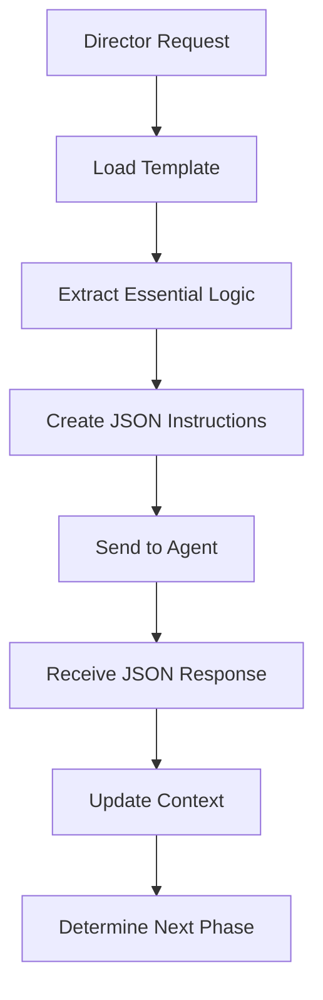

# Director MCP Server

🎯 **Intelligent workflow orchestration and multi-agent coordination server**

The Director MCP Server is the central orchestration hub for multi-agent workflows. It loads workflow templates, creates focused JSON instructions for agents, manages shared context, and coordinates complex multi-phase operations.

## 🚀 Quick Start

### Development Mode
```bash
# Install dependencies
npm install

# Start in development mode
npm run dev

# Build for production
npm run build

# Start production server
npm start
```

### Docker Mode
```bash
# Build Docker image
docker build -t director-mcp-server .

# Run container
docker run -p 3002:3002 director-mcp-server
```

## 📋 Features

### 🎯 **Core Capabilities**
- **Template Processing**: Load and process workflow templates from JSON files
- **Instruction Creation**: Extract essential logic and create focused agent instructions  
- **Context Management**: Maintain shared workflow state across multiple phases
- **Agent Communication**: Coordinate with multiple agents via HTTP APIs
- **Error Recovery**: Robust error handling and retry mechanisms

### 🔧 **MCP Tools** 
- `getWorkflowTemplate(workflow_type)`: Load complete workflow templates
- `createAgentInstructions(options)`: Generate focused JSON instructions
- `executeWorkflow(parameters)`: Full workflow execution with context tracking

### 📊 **Performance Optimizations**
- **Template Caching**: In-memory caching of workflow templates
- **Efficient Communication**: 83% size reduction (2.5KB vs 15KB templates)
- **Context Persistence**: Lightweight shared state management
- **Retry Logic**: Exponential backoff for agent communication

## 🏗️ Architecture

### **Core Components**

```
Director MCP Server
├── Template Manager     # Load and process workflow templates
├── Context Manager      # Shared workflow state and coordination  
├── Agent Communicator   # HTTP communication with agents
└── HTTP API Server      # REST endpoints and MCP tools
```

### **Communication Flow**



### **Data Flow**

1. **Template Loading**: 15KB workflow templates loaded internally
2. **Instruction Creation**: Essential 2.5KB JSON instructions extracted
3. **Agent Communication**: Lightweight JSON sent to agents
4. **Response Processing**: Agent results integrated into shared context
5. **Phase Coordination**: Multi-step workflow orchestration

## 📡 API Endpoints

### **MCP Tools (Core Director Functions)**

#### `POST /api/mcp/get-workflow-template`
Load workflow template for Director Agent
```json
{
  "workflow_type": "idea_categorization",
  "parameters": { "limit": 5 },
  "cache_duration": 3600
}
```

#### `POST /api/mcp/create-agent-instructions`  
Create focused JSON instructions from template
```json
{
  "workflow_type": "idea_categorization",
  "target_agent": "notion",
  "parameters": {
    "source_database_id": "16cd7be3dbcd80e1aac9c3a95ffaa61a",
    "limit": 5
  }
}
```

#### `POST /api/mcp/execute-workflow`
Execute complete workflow with context tracking
```json
{
  "workflow_type": "idea_categorization", 
  "target_agent": "notion",
  "parameters": {
    "source_database_id": "16cd7be3dbcd80e1aac9c3a95ffaa61a",
    "projects_database_id": "3cd8ea052d6d4b69956e89b1184cae75"
  }
}
```

### **Agent Communication**

#### `POST /api/agents/:agentId/execute`
Send instructions to specific agent

#### `POST /api/agents/response?context_id=:contextId`
Receive response from agent

#### `GET /api/agents/health`
Check health of all configured agents

### **Context Management**

#### `GET /api/context/:contextId`
Get complete workflow context

#### `GET /api/context/:contextId/agent/:agentId`
Get context specific to an agent

#### `GET /api/context`
List all active workflow contexts

### **System Management**

#### `GET /health`
Server health check

#### `GET /api/stats`
System performance statistics

#### `POST /api/admin/clear-cache`
Clear template cache

## 🔧 Configuration

### **Environment Variables**
```bash
PORT=3002                    # Server port
LOG_LEVEL=info              # Logging level
NODE_ENV=development        # Environment mode
CORS_ORIGIN=*               # CORS origin
```

### **Agent Endpoints**
Configure agent communication in `agent-communicator.ts`:
```typescript
// Default agent endpoints
notion: http://localhost:5678/webhook/notion-agent-execute
planner: http://localhost:5678/webhook/planner-agent-execute  
validation: http://localhost:5678/webhook/validation-agent-execute
```

## 📁 Template System

### **Template Directory Structure**
```
director-mcp/workflow-templates/
├── idea-categorization-v1.json    # Complete workflow definition
├── template-registry.json         # Template index
└── [future-workflow-templates.json]
```

### **Template Processing**
1. **Load Template**: 15KB complete workflow definition
2. **Extract Sections**: Categorization methodology, execution requirements
3. **Populate Parameters**: Replace variables with runtime values
4. **Create Instructions**: 2.5KB focused JSON for agent

### **Supported Template Types**
- `idea_categorization`: Multi-idea parsing and database routing
- `database_updates`: Page creation and property updates
- `content_processing`: Content analysis and transformation
- *(Extensible for new workflow types)*

## 🔄 Workflow Execution

### **Phase 1: Categorization**
```json
// Director creates instructions:
{
  "instruction": {
    "task_type": "multi_idea_categorization",
    "objective": "Parse content for multiple distinct ideas"
  },
  "categorization_methodology": {
    "multi_idea_parsing_rules": [...],
    "database_routing_criteria": {...},
    "tagging_rules": {...}
  }
}
```

### **Phase 2: Execution**
```json
// Director creates execution instructions:
{
  "instruction": {
    "task_type": "database_page_updates", 
    "objective": "Execute database updates based on categorization"
  },
  "database_execution": {
    "operations": [
      {
        "action": "create_page",
        "target_database_id": "3cd8ea052d6d4b69956e89b1184cae75",
        "properties": {...}
      }
    ]
  }
}
```

## 📊 Performance Metrics

### **Efficiency Gains**
- **83% Size Reduction**: 2.5KB instructions vs 15KB templates
- **Fast Processing**: Agents receive focused instructions only
- **Low Token Usage**: ~200 tokens vs 2000+ per agent call
- **Template Caching**: Sub-millisecond template access

### **Monitoring**
- **Request Logging**: Structured logs with correlation IDs
- **Performance Tracking**: Response times and bottleneck detection
- **Error Tracking**: Categorized errors with suggested actions
- **Health Checks**: Agent availability and system status

## 🧪 Testing

### **Health Check**
```bash
curl http://localhost:3002/health
```

### **Template Loading**
```bash
curl -X POST http://localhost:3002/api/mcp/get-workflow-template \
  -H "Content-Type: application/json" \
  -d '{"workflow_type": "idea_categorization"}'
```

### **Agent Communication**
```bash
curl -X GET http://localhost:3002/api/agents/health
```

## 🔗 Integration

### **With n8n Agents**
- Communicates via webhook endpoints
- Sends JSON instructions to agent parsers
- Receives structured JSON responses

### **With Notion MCP Server**
- Uses existing database tools and endpoints
- Maintains compatibility with current API

### **With Workflow Templates**
- Loads templates from `director-mcp/` directory
- Uses template registry for discovery
- Supports versioning and caching

## 🚧 Development

### **Project Structure**
```
src/
├── templates/           # Template loading and processing
├── communication/       # Agent communication
├── context/            # Workflow context management
├── validation/         # Schema validation
├── types/              # TypeScript type definitions
├── utils/              # Logging and utilities
└── index.ts           # Main server file
```

### **Key Design Principles**
- **Template-Driven**: All workflow logic defined in JSON templates
- **Agent-Agnostic**: Generic communication patterns for all agent types
- **Context-Aware**: Shared state maintained across all workflow phases
- **Error-Resilient**: Comprehensive error handling and recovery
- **Performance-Optimized**: Efficient template processing and caching

### **Adding New Workflows**
1. Create new template JSON in `director-mcp/workflow-templates/`
2. Add entry to `template-registry.json`
3. Update agent capabilities if needed
4. Test with target agents

---

## 🎯 Next Steps

1. **Deploy Server**: Start Director MCP server for template loading
2. **Test Integration**: Verify communication with Notion Agent
3. **Add Workflows**: Implement additional workflow templates
4. **Scale Agents**: Add Planner and Validation agents
5. **Monitor Performance**: Track metrics and optimize bottlenecks

**The Director MCP Server provides the foundation for intelligent, scalable multi-agent workflow orchestration!** 🚀
