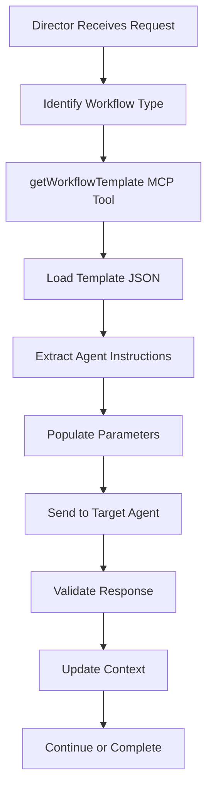

# Director MCP Server Components

This directory contains the foundational components for the Director Agent's MCP server, enabling intelligent workflow orchestration and multi-agent coordination.

## 📁 Directory Structure

```
director-mcp/
├── workflow-templates/          # Workflow template definitions
│   ├── idea-categorization-v1.json    # Idea categorization workflow
│   └── template-registry.json         # Template registry and index
├── agent-capabilities/          # Agent capability schemas
│   └── [agent-name]-capabilities.json
├── schemas/                     # JSON validation schemas
│   ├── workflow-template-schema.json
│   ├── agent-instruction-schema.json
│   └── communication-schema.json
└── README.md                   # This file
```

## 🎯 Workflow Templates

### Purpose
Workflow templates define complete multi-phase processes that the Director Agent can orchestrate. Each template contains:

- **Phase Definitions**: Step-by-step instructions for each workflow phase
- **Agent Instructions**: Complete prompts and parameters for agent execution
- **Output Schemas**: Expected JSON structures for validation
- **Error Handling**: Timeout, retry, and error recovery strategies
- **Debugging Properties**: Logging, monitoring, and troubleshooting features

### Current Templates

#### `idea-categorization-v1.json`
- **Type**: Idea Processing
- **Agent**: Notion Agent
- **Purpose**: Parse multiple ideas from source posts and categorize into Projects/Knowledge/Journal databases
- **Output**: Structured categorization analysis with database routing decisions

## 🔧 MCP Server Integration

### How the Director Accesses Templates

The Director MCP server will implement these endpoints:

```typescript
// Get specific workflow template
GET /api/workflows/templates/{template_id}
// Returns: Complete workflow template JSON

// List all available templates  
GET /api/workflows/templates
// Returns: Template registry with metadata

// Validate template against schema
POST /api/workflows/templates/{template_id}/validate
// Returns: Validation results and any errors
```

### Director Agent Usage

```javascript
// Director Agent workflow:
1. Analyze incoming request
2. Determine workflow type needed
3. Call: getWorkflowTemplate("idea_categorization")
4. Receive: Complete template with agent instructions
5. Compose specific instructions for target agent
6. Send instructions to agent
7. Validate agent response against expected schema
8. Update shared context with results
```

### Template Processing Flow



## 📋 Template Structure

### Core Components

```json
{
  "workflow_id": "unique_identifier",
  "workflow_name": "Human readable name",
  "phases": [
    {
      "agent_instructions": {
        "full_prompt": "Complete LLM prompt",
        "parameters": "Dynamic values",
        "required_tools": ["tool1", "tool2"]
      },
      "expected_output_schema": "JSON Schema",
      "error_handling": "Recovery strategies"
    }
  ],
  "debugging_properties": "Logging and monitoring",
  "mcp_tool_compatibility": "API integration details"
}
```

### Key Features

- **Full Prompts Embedded**: Complete LLM prompts included for immediate use
- **Dynamic Parameters**: Template variables populated at runtime
- **Schema Validation**: Strict output format validation
- **Error Recovery**: Multiple fallback strategies
- **Debug Integration**: Comprehensive logging and monitoring
- **MCP Compatibility**: Direct API endpoint mapping

## 🚀 Future Development

### Planned Templates
- `project-management-v1.json`: Task tracking and sprint planning
- `content-creation-v1.json`: Research → Draft → Review → Publish
- `data-analysis-v1.json`: Gather → Analyze → Report workflows

### Agent Capabilities Integration
- Dynamic agent discovery via capability schemas
- Tool availability validation
- Workload balancing across agents

### Context Management
- Shared workflow context templates
- Cross-phase data preservation
- Performance metric collection

## 🔗 Integration Points

### With Existing Systems
- **n8n Workflows**: Template-based n8n workflow generation
- **Notion MCP Server**: Database operation capabilities
- **Sync Scripts**: Automatic template synchronization

### With Future Systems
- **Director MCP Server**: Primary integration point
- **Agent Registration System**: Capability-based routing
- **Monitoring Dashboard**: Workflow performance tracking

---

## 📝 Notes for Implementation

When building the Director MCP server, the `getWorkflowTemplate(workflow_type)` function should:

1. **Load Template**: Read from `workflow-templates/{template_id}.json`
2. **Validate Structure**: Check against template schema
3. **Return Complete Object**: Full template with all properties
4. **Cache Results**: Templates can be cached for performance
5. **Handle Errors**: Graceful fallback for missing templates

The template registry (`template-registry.json`) provides metadata for template discovery and API endpoint mapping.

**This system enables the Director Agent to dynamically compose complex multi-agent workflows while maintaining consistency, debugging capabilities, and error recovery.**
