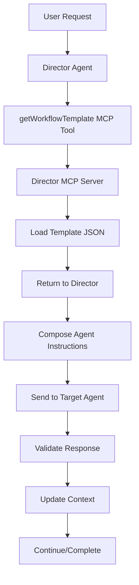

# Director MCP Server Integration Guide

## 🎯 Overview

The Director MCP Server system enables intelligent workflow orchestration through template-based agent coordination. This document provides integration guidance and references.

## 📁 System Location

**Primary Directory**: `/director-mcp/`

```
director-mcp/
├── workflow-templates/          # Complete workflow definitions
│   ├── idea-categorization-v1.json    # First implemented template
│   └── template-registry.json         # Template index and metadata
├── agent-capabilities/          # Agent capability schemas (future)
├── schemas/                     # JSON validation schemas (future)
└── README.md                   # Complete system documentation
```

## 🔧 Current Implementation Status

### ✅ Completed
- **Workflow Template Structure**: Complete JSON template format defined
- **Idea Categorization Template**: First working template implemented
- **Template Registry**: Index system for template discovery
- **MCP Integration Design**: API endpoint structure planned
- **Documentation**: Comprehensive README and integration guides

### 🚧 Pending Implementation
- **Director MCP Server**: Actual server implementation
- **getWorkflowTemplate() Function**: MCP tool implementation
- **Agent Capabilities Schema**: Individual agent capability definitions
- **JSON Validation Schemas**: Template and communication validation
- **Error Handling System**: Robust error recovery implementation

## 🎯 Integration with Director Agent

### Workflow Template Access

When implemented, the Director Agent will access templates via:

```javascript
// Director Agent MCP Tool Call
const template = await getWorkflowTemplate("idea_categorization");

// Returns complete workflow definition:
{
  "workflow_id": "idea_categorization_v1",
  "phases": [
    {
      "agent_instructions": {
        "full_prompt": "You are the Notion Agent...",
        "parameters": {...},
        "required_tools": [...]
      },
      "expected_output_schema": {...}
    }
  ]
}
```

### Template Benefits for Director

1. **Complete Prompts**: Full LLM prompts embedded, ready for agent instruction
2. **Parameter Templates**: Dynamic values with fallbacks and validation
3. **Output Schemas**: Strict JSON validation for reliable communication
4. **Error Strategies**: Predefined error handling and recovery methods
5. **Debug Properties**: Built-in logging and monitoring configurations

## 🔗 Integration Points

### With Current Systems

#### n8n Workflows
- Templates can generate n8n workflow configurations
- Existing individual agent tests provide foundation
- Sync scripts can update templates when agents change

#### Notion MCP Server  
- Templates reference current MCP tools and endpoints
- Database ID configurations align with existing setup
- Tool descriptions match current API capabilities

#### Agent Testing
- Template validation against actual agent capabilities
- Individual agent tests verify template assumptions
- Error scenarios test template error handling

### With Future Systems

#### Director MCP Server
- Primary consumer of workflow templates
- Implements `getWorkflowTemplate()` MCP tool
- Provides template validation and caching

#### Agent Capabilities Registry
- Dynamic agent discovery via capability schemas
- Template validation against agent capabilities
- Automatic template updates when capabilities change

## 📋 Next Steps for Implementation

### Phase 1: MCP Server Foundation
1. **Create Director MCP Server**: Basic Express/TypeScript server
2. **Implement Template Loading**: File-based template system
3. **Add MCP Tool**: `getWorkflowTemplate(workflow_type)` function
4. **Basic Validation**: Template structure validation

### Phase 2: Template System
1. **Template Validation**: JSON schema validation
2. **Parameter Substitution**: Dynamic value replacement
3. **Error Handling**: Template error recovery
4. **Caching System**: Performance optimization

### Phase 3: Agent Integration
1. **Capability Schemas**: Individual agent capability definitions
2. **Dynamic Discovery**: Agent capability validation
3. **Template Sync**: Automatic updates via sync scripts
4. **End-to-End Testing**: Complete workflow validation

## 🎯 Expected Workflow Flow



## 📚 Reference Documents

- **Complete System Docs**: `/director-mcp/README.md`
- **Template Example**: `/director-mcp/workflow-templates/idea-categorization-v1.json`
- **Template Registry**: `/director-mcp/workflow-templates/template-registry.json`
- **Agent Testing Guide**: `/docs/development/AGENT_TESTING_GUIDE.md`

## 🔧 Development Commands

```bash
# View template structure
cat director-mcp/workflow-templates/idea-categorization-v1.json | jq

# Check template registry
cat director-mcp/workflow-templates/template-registry.json | jq

# Validate JSON structure (when schemas available)
npx ajv validate -s schemas/template-schema.json -d workflow-templates/*.json
```

---

**This template system provides the foundation for scalable, maintainable multi-agent workflows with comprehensive debugging and error recovery capabilities.**
