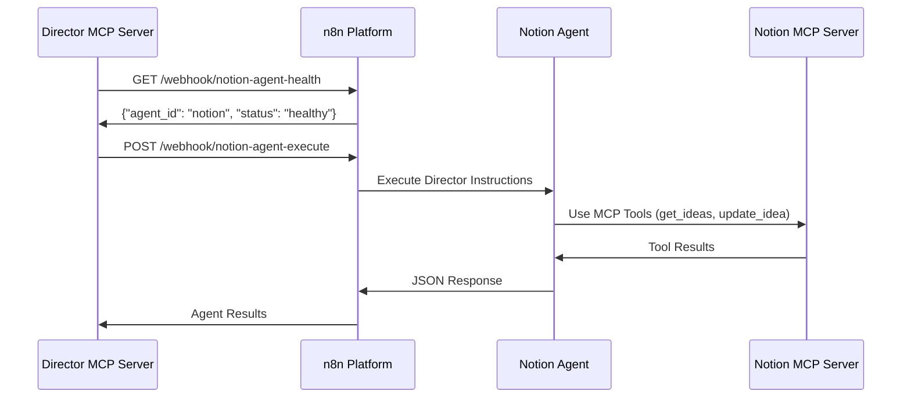

# Director + Notion Agent Integration Testing

## 🎯 Overview

This document outlines the integration testing setup for the Director MCP Server and Notion Agent communication.

## 🏗️ Architecture

```
Director MCP Server (Port 3002) ←→ n8n Webhooks (Port 5678) ←→ Notion Agent + MCP Tools (Port 3001)
```

## 📁 Files Created/Modified

### ✅ Updated Files
- **`n8n/workflows/individual-agents/notion-agent.json`** - Added webhook endpoints
- **`n8n/workflows/multi-agent-workflow-system.json`** - Renamed from simplified-intelligent-director.json

### 🆕 New Files  
- **`n8n/workflows/director-notion-integration-test.json`** - Isolated Director + Notion integration test
- **`n8n/workflows/webhook-bridges/notion-agent-health.json`** - Health check webhook
- **`n8n/workflows/webhook-bridges/planner-agent-health.json`** - Planner health webhook

## 🔧 Integration Test Setup

### Step 1: Import Workflows into n8n

Navigate to **http://localhost:5678** and import these workflows:

1. **Notion Agent with Webhooks**
   ```bash
   File: n8n/workflows/individual-agents/notion-agent.json
   ```
   
2. **Director + Notion Integration Test**
   ```bash
   File: n8n/workflows/director-notion-integration-test.json
   ```

### Step 2: Activate Webhook Endpoints

After importing, the following webhook endpoints will be active:

| Agent | Health Endpoint | Execute Endpoint | Status Endpoint |
|-------|----------------|------------------|-----------------|
| Notion | `GET /webhook/notion-agent-health` | `POST /webhook/notion-agent-execute` | `GET /webhook/notion-agent-status` |
| Planner | `GET /webhook/planner-agent-health` | `POST /webhook/planner-agent-execute` | `GET /webhook/planner-agent-status` |
| Validation | `GET /webhook/validation-agent-health` | `POST /webhook/validation-agent-execute` | `GET /webhook/validation-agent-status` |

### Step 3: Test Integration

#### 3a. Test Health Endpoints
```bash
# Should now return success
curl -s http://localhost:3002/api/agents/health | jq
```

#### 3b. Run Integration Test
In n8n, execute the **"Director + Notion Integration Test"** workflow manually.

#### 3c. Run Full Test Suite
```bash
./testing/test-director-endpoints.sh
```

## 🔄 Integration Flow



## 🧪 Test Scenarios

### Scenario 1: Health Check Integration
- **Test**: Director calls agent health endpoints
- **Expected**: All agents return healthy status
- **Validates**: Basic Director ↔ Agent communication

### Scenario 2: Full Workflow Integration  
- **Test**: Director creates instructions → Notion executes → Context updated
- **Expected**: End-to-end JSON communication works
- **Validates**: Complete integration flow

### Scenario 3: MCP Tool Usage
- **Test**: Notion Agent uses MCP tools via Director instructions
- **Expected**: Tools execute successfully, results returned
- **Validates**: Agent can access Notion database via MCP tools

## ✅ Success Indicators

### Director MCP Server Health
```json
{
  "success": false, // ❌ Before import
  "success": true   // ✅ After import & activation
}
```

### Integration Test Results
```json
{
  "summary": {
    "status": "SUCCESS",
    "director_mcp_server": "WORKING",
    "notion_agent": "WORKING", 
    "integration_flow": "TESTED"
  }
}
```

## 🚀 Next Steps

1. **Import workflows into n8n**
2. **Activate all webhook endpoints** 
3. **Run integration tests**
4. **Verify health endpoints return success**
5. **Test full Director → Agent communication**

## 🛟 Troubleshooting

| Issue | Solution |
|-------|----------|
| 404 errors | Import and activate webhook workflows in n8n |
| Health checks fail | Ensure webhook endpoints are active |
| Integration test fails | Check Director MCP Server logs |
| MCP tools not working | Verify Notion MCP Server is running |

---

**Ready to test the complete Director + Notion Agent integration!** 🎯
